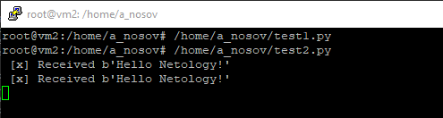

**11.4 "Очереди RabbitMQ"**

**Задание 1**

**Задание 2**

**channel.basic\_consume('hello', callback, auto\_ack=True)**

**Задание 3**

Выполнение работает из обеих нод кластера

Удаление так же работает из обеих нод:

Работа при погашеной первой ноде:

